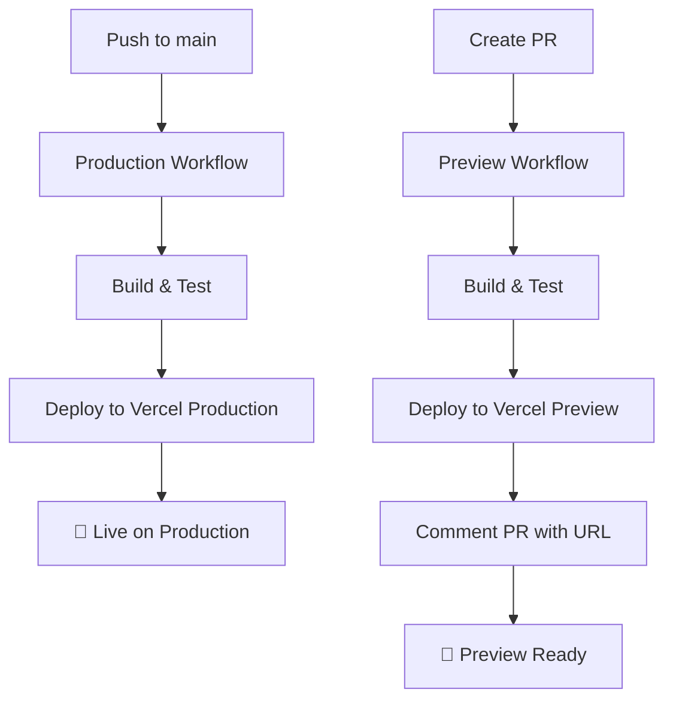

# 🎉 Vercel Deployment Setup Complete!

## 📋 What Was Created

### 1. Enhanced Production Deployment Workflow
**File:** `.github/workflows/deploy_to_vercel.yml`

**Improvements Made:**
- ✅ Added concurrency control to prevent duplicate deployments
- ✅ Enhanced caching for faster builds (Next.js and node_modules)
- ✅ Better environment variable management
- ✅ Added build step with proper environment variables
- ✅ Separated Vercel configuration and deployment steps
- ✅ Added verification and cleanup steps
- ✅ Used `--frozen-lockfile` for deterministic dependency installation

### 2. New Preview Deployment Workflow
**File:** `.github/workflows/deploy_preview.yml`

**Features Added:**
- ✅ Automatic preview deployments for every pull request
- ✅ PR comments with preview URLs
- ✅ Auto-updates when new commits are pushed to PR
- ✅ Concurrency control per PR number
- ✅ Same caching and optimization as production
- ✅ Cleanup after deployment

### 3. Comprehensive Deployment Guide
**File:** `.github/DEPLOYMENT_GUIDE.md`

**Includes:**
- ✅ Step-by-step deployment instructions
- ✅ Required secrets documentation
- ✅ Troubleshooting guide
- ✅ Best practices
- ✅ Security recommendations
- ✅ Configuration examples

## 🔑 Secrets Configuration

The workflows are configured to use these GitHub Secrets:

| Secret Name | Status | Notes |
|-------------|--------|-------|
| `VERCEL_ORG_ID` | ✅ Configured | `team_DHrbq84M9jjpU5AoXXIFgbXA` |
| `VERCEL_PROJECT_ID` | ✅ Configured | `prj_pVLfD75kOHpDm7LyAcwhaeJ8Jn0r` |
| `VERCEL_TOKEN` | ✅ Configured | Vercel API token |
| `MISTRAL_API_KEY` | ✅ Configured | `7IyIWq3A84xe5y8aPdyZCIJLEH4ZZ8wN` |
| `NEXT_PUBLIC_BASE_URL` | ⚠️ Needs setup | Set to your production domain |

## 🚀 How to Deploy

### Production Deployment

1. **Push to main branch:**
   ```bash
   git push origin main
   ```

2. **Monitor deployment:**
   - GitHub Actions: Watch the workflow run
   - Vercel Dashboard: View deployment progress

### Preview Deployment

1. **Create a pull request:**
   ```bash
   git checkout -b feature/your-feature
   git push origin feature/your-feature
   # Then create PR via GitHub UI
   ```

2. **Preview will be automatically deployed**

3. **Check PR comments** for the preview URL

## 🎯 Key Benefits

### For Developers
- ✅ Instant preview deployments for every PR
- ✅ No manual deployment steps needed
- ✅ Automatic updates when PR changes
- ✅ Easy testing before merging

### For Maintainers
- ✅ Automatic production deployments
- ✅ Build caching for faster deployments
- ✅ Concurrency control prevents duplicate work
- ✅ Clean separation of production and preview

### For Security
- ✅ All secrets managed via GitHub Secrets
- ✅ No hardcoded credentials
- ✅ Proper token permissions
- ✅ Cleanup after deployments

## 📊 Deployment Flow



## 🔧 Next Steps

1. **Set your production domain:**
   ```bash
   # Add to GitHub Secrets
   Name: NEXT_PUBLIC_BASE_URL
   Value: https://your-production-domain.com
   ```

2. **Test the workflow:**
   - Create a test PR to verify preview deployments
   - Push to main to test production deployment

3. **Monitor and optimize:**
   - Check GitHub Actions for build times
   - Monitor Vercel dashboard for performance
   - Adjust caching as needed

## 🎉 Success Criteria

- ✅ Production deployments work automatically
- ✅ Preview deployments work for every PR
- ✅ All secrets are properly configured
- ✅ Build caching is optimized
- ✅ Deployment process is documented

**Your Vercel deployment workflow is now ready to use!** 🚀